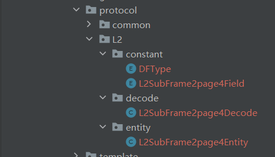

## 项目简介

本项目是一个报文解析代码生成器，使用的编程语言为**Java**和**freemarker**。若您有着解析大量不同类型报文的需求，并且想要获取到报文解析后对应的实体，该项目可能对您有所帮助。

## 使用方法

##### 1.在application.yml中定义报文所需要的关键信息，根据提供的模板修改其中配置项的内容

最外层一共有四个大的配置项，分别是：

| 属性名        | 属性类型    | 属性含义                                                     |
| ------------- | ----------- | ------------------------------------------------------------ |
| packagePath   | String      | 将要生成代码所处的包名，具体含义为报文的大类型，如b1c，b2a，L2 |
| entityName    | String      | 生成代码的类名，含义是对应大报文中对应的某一子帧页面         |
| HighByteFirst | boolean     | 该信息段（子帧）是否是高字节先传                             |
| list          | List<Field> | 该信息段（子帧）中的数据属性信息列表，其中每一个数据段的配置在下方表格展示 |

> tips:entityName的命名方式建议
>
> - 若配置的内容为L2报文中的子帧2的页面3，则命名可以为 **L2SubFrame2Page3**
> - 若没有页面的话，假如内容为L2报文中的子帧3则命名可以为 **L2SubFrame3**

数据属性的配置信息列表

| 属性名         | 属性类型                             | 属性含义                   |
| -------------- | ------------------------------------ | -------------------------- |
| fieldName      | String                               | 字段名                     |
| bit            | int                                  | 字段长度                   |
| fieldType      | String，可选值为UInt，IntS，Bit，Int | 字段类型                   |
| notes          | String                               | 字段注释                   |
| baseNumber     | double                               | 比例因子的底数             |
| indexNumber    | double                               | 比例因子的指数             |
| existRange     | boolean                              | 转换后的实数是否存在范围   |
| rangeMinNumber | double                               | 若范围存在，则为范围的下界 |
| rangeMaxNumber | double                               | 若范围存在，则为范围的上界 |

**具体的示例可以参照示例的application.yml**

##### 2.定义完成后，启动springboot项目，生成的代码会在protocol包中出现，例如L2包生成结构如下

##### 3.一些使用建议

- 保存所有的yml配置文件，用于后续拓展
- yml配置文件的命名可以为application-xxxxxx-yml，方便后续分类收集和查看
- 

## 词汇表

> **对于属性变量的命名方式，下方给出一些参考方案**

##### 1.对于希腊字母，采取的命名用对应读法来表示

##### 2.对于某个希腊字母上面有 “  .  ” 等其他修饰符时。即$\dot{A}$ 这种，我们java采用的命名方式为 A\$dot\$ 。即采用$$来包含头部信息

在$$ 中间添加想要的内容,若为点的话为dot

##### 3.对于下标的情况，我们采用下划线来命名。若为$t_0$  我们采用 t_0来命名

##### 

##### 4.总体命名还是采取驼峰式命名法。

下面举几个命名例子

| 字段名            | java的命名         |
| ----------------- |-----------------|
| $\Omega_0$        | omega_0         |
| $SISAIocb~$       | sisai_ocb       |
| $\Delta \dot n_0$ | deltaN\$dot\$_0 |

